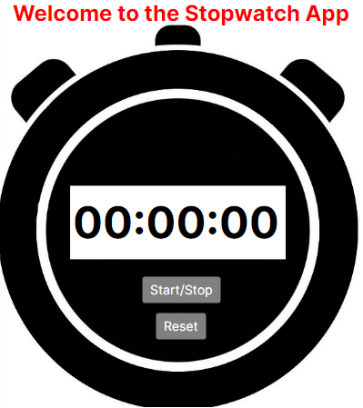

# Stopwatch Desktop App

A simple yet powerful desktop stopwatch application built to help you track time for any task or activity. The Stopwatch Desktop App is designed for quick usability and a distraction-free experience. Whether you need to time your workouts, study sessions, or any other task, this app has you covered!

## Features

- **Start, Pause, and Reset:** Easily control your stopwatch with intuitive buttons.
- **Lap Tracking:** Record lap times to monitor split durations. (Coming Soon)
- **Minimalist UI:** Clean and user-friendly interface for maximum focus.
- **Lightweight:** Fast and efficient, with low resource usage.

## Screenshots

## Usage

- **Start:** Click the "Start" button to begin timing.
- **Pause:** Click "Pause" to temporarily stop the timer.
- **Reset:** Click "Reset" to clear the timer and start over.
- **Lap:** Use the "Lap" button to record split times (Coming Soon).

## Development

Contributions are welcome! To contribute:

1. Fork the repository
2. Create a new branch (`git checkout -b feature/your-feature`)
3. Commit your changes (`git commit -m 'Add some feature'`)
4. Push to the branch (`git push origin feature/your-feature`)
5. Open a pull request

## License

This project is licensed under the [MIT License](LICENSE).

## Contact

For questions or feedback, open an issue or contact [@cgosseen](https://github.com/cgosseen).

---

*Happy timing!*
